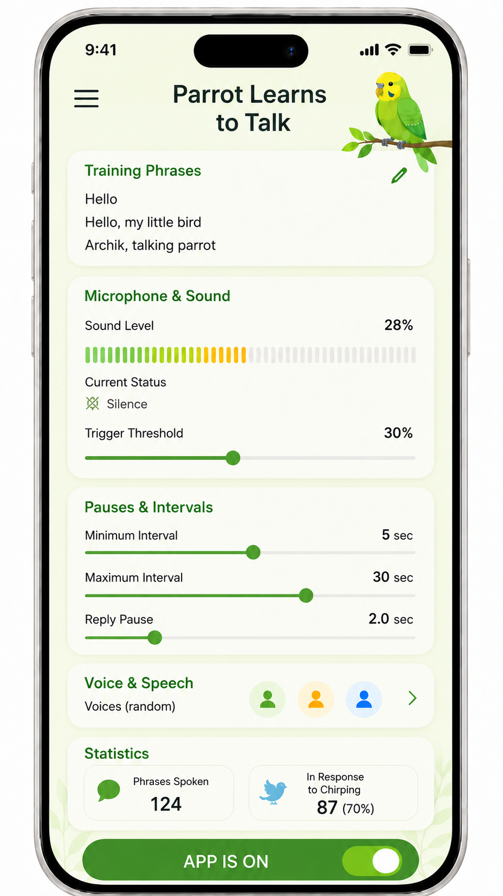

# 🦜 Parrot Trainer

**A simple Android app that helps your parrot practice human speech through repetition and response.**

  

Parrot Trainer listens to the room and reacts when your bird makes a sound. After a short pause, it plays one of your training phrases using text-to-speech. If the room stays quiet for too long, the app can repeat a phrase automatically.

The idea is simple: **your parrot makes a sound → hears a familiar phrase → gets a chance to respond.**

## What you can control

- your own training phrases;
- microphone sensitivity and trigger threshold;
- minimum and maximum intervals between phrases;
- response pause after the bird makes a sound;
- one or several TTS voices, including random voice selection;
- speech rate, pitch, and volume.

The main screen also shows the current sound level, listening status, and simple statistics such as phrases spoken and bird responses.

Everything is available from one screen: place the phone near the cage, tune the sensitivity, switch training on, and let the app handle the repetitions.

> Parrot Trainer is a training aid, not a guarantee that a bird will learn to speak. Every parrot learns differently.

Developer notes, build instructions, and implementation details are in [DEVELOPMENT.md](DEVELOPMENT.md).
